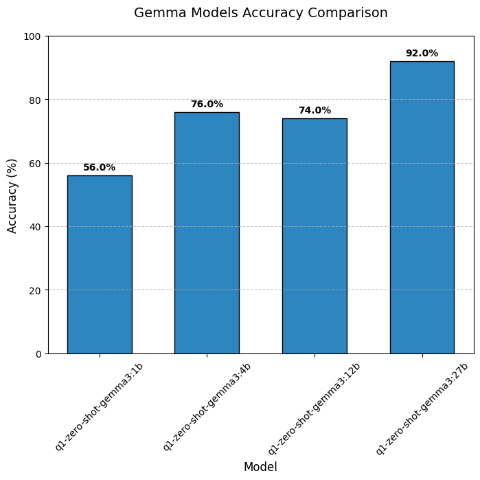

# Small Gemma Models for Code Generation

[](LICENSE)

## 📋 Overview

This research project investigates whether smaller Gemma models (1B, 4B) can achieve code generation capabilities comparable to their larger counterparts (12B, 27B) through various enhancement techniques. We explore:

- Zero-shot baseline approaches
- Few-shot learning approaches
- Zero- and few-shot approaches with additional reflection from additional model

## 🔍 Research Questions

1. What are the baseline zero-shot capabilities across different Gemma model sizes?
2. How stable are smaller models' results in zero-shot scenarios?
3. What improvements can be achieved through few-shot approaches?
4. How does the number of examples in few-shot learning influence results?
5. Can the additional reflection regarding the task improve the results?

## 🧪 Methodology

### Dataset

We utilize a hand-verified subset of the [Mostly Basic Python Problems (MBPP)](https://github.com/google-research/google-research/tree/master/mbpp) benchmark. The original MBPP dataset includes 1,000 Python programming problems for entry-level programmers, each containing:
- Task description
- Reference solution
- 3 test cases for validation
Moreover, for the purpose of this repository we use 50 test examples due to computational budget limitations.

### Experimental Approaches

1. **Zero-shot baseline**: Direct code generation without examples
2. **Few-shot baseline**: Direct code generation with examples
3. **Reflection Agent**: Direct code generation with additional reflection regarding the task from the external model

All experiments run locally on Apple Silicon M4 Pro processors for reproducibility.

## 📊 Key Findings

### Q1: Zero-Shot Capabilities Across Model Sizes

For our evaluation, we generated one code sample per problem with temperature set to $0.5$ and assessed whether it passed all three provided test cases.



Model performance gradually improves with parameter count, starting from 63.3% for the 1B model and reaching 90% for the 27B model.

### Q2: Results Stability in Zero-Shot Scenarios

We evaluated result stability by generating 5 different responses for each query and tracking accumulated accuracy across iterations.


Our analysis shows that results stabilize after 2-3 iterations, informing our experimental design choices. For subsequent experiments, we standardized on 3 iterations to ensure result comparability.

### Q3: Zero-Shot vs. Few-Shot Comparison
We analyze the impact of providing examples for the model into the prompt. For that purpose we evaluate the zero-shot approach and few-shot approach with 3 examples. Both experiments are calculated three times and we calculate accuracy based on the information whether any of the model trials for each task was successful.


We can observe that the results for the provided runs were significantly improved. However, it's worth noting that the results of zero-shot approach are significantly lower than usual, e.g., presented in Q1 and Q2 results.


### Q4: Impact of Example Count in Few-Shot Learning
In this section, we analyze the impact of number of examples to the model performance in a few-shot scenario. The methodology is similar to previous research questions, i.e., 3 runs with the accuracy at any successful attempt.


We can observe that increasing number of examples in the few-shot scenario has a significant impact on the model performance. What is worrying regarding the results is the fact that model in the 7-shot approach is not performing better than 3-shot approach in the Q3. Moreover, we can observe the significant gap between results for 3-shot approach between Q3 and Q4 which might be a result of the significant randomness in the model generation capabilities. One of the possible solutions would be running the model by more iterations or evaluating model on more examples. However, both solutions require more computational budget. Finally, even though we have seen in Q2 that the results are stabilizing around 3 iterations, in pratice it turns out that it's not necessarily true.

### Q5: Self-Improvement Techniques

In this section, we analyze whether providing additional reflection regarding the task from an external Gemma 4B model can improve the results. We compare the zero-shot approach with the reflection approach, where the model receives additional insights. For the purpose of this task we analyze only one iteration due to computational constraints. Moreover, we are using 4B models as 1B models are too unstable to conclude something.


Suprisingly the self-reflection don't make the model results stronger and the results are on par.

## 🚀 Getting Started

### Prerequisites

- [uv](https://github.com/astral-sh/uv) - Modern Python package installer
- [ollama](https://ollama.com/download) - Local LLM runner

### Installation

1. Download Gemma models:
```bash
ollama pull gemma3:1b
ollama pull gemma3:4b
ollama pull gemma3:12b
ollama pull gemma3:27b
```

2. Install dependencies:
```bash
uv venv
uv pip install .
```

## 🔧 Usage

### Running Experiments

```bash
# Basic zero-shot experiments
uv run run_experiments.py --experiment_type single-model --experiment_name q1-zero-shot-gemma3:1b --model_name gemma3:1b
uv run run_experiments.py --experiment_type single-model --experiment_name q1-zero-shot-gemma3:4b --model_name gemma3:4b
uv run run_experiments.py --experiment_type single-model --experiment_name q1-zero-shot-gemma3:12b --model_name gemma3:12b
uv run run_experiments.py --experiment_type single-model --experiment_name q1-zero-shot-gemma3:27b --model_name gemma3:27b

# Stability analysis
uv run run_experiments.py --experiment_type single-model --experiment_name q2-gemma3:1b --model_name gemma3:1b --num-iterations 5

# Zero-shot vs. Few-shot Comparison
uv run run_experiments.py --experiment_type single-model --experiment_name q3-zero-shot-gemma3:1b --model_name gemma3:1b --num-iterations 3 --num-few-shot-examples 0
uv run run_experiments.py --experiment_type single-model --experiment_name q3-few-shot-gemma3:1b --model_name gemma3:1b --num-iterations 3 --num-few-shot-examples 3

# Few-shot Number of Examples Analysis
uv run run_experiments.py --experiment_type single-model --experiment_name q4-few-shot-1-gemma3:1b --model_name gemma3:1b --num-iterations 3 --num-few-shot-examples 1
uv run run_experiments.py --experiment_type single-model --experiment_name q4-few-shot-3-gemma3:1b --model_name gemma3:1b --num-iterations 3 --num-few-shot-examples 3
uv run run_experiments.py --experiment_type single-model --experiment_name q4-few-shot-5-gemma3:1b --model_name gemma3:1b --num-iterations 3 --num-few-shot-examples 5
uv run run_experiments.py --experiment_type single-model --experiment_name q4-few-shot-7-gemma3:1b --model_name gemma3:1b --num-iterations 3 --num-few-shot-examples 7

# Reflection Approach
uv run run_experiments.py --experiment_type single-model --experiment_name q5-zero-shot-gemma3:4b --model_name gemma3:4b --num-iterations 3 --num-few-shot-examples 0
uv run run_experiments.py --experiment_type reflection-approach --experiment_name q5-reflection-approach-gemma3:4b --model_name gemma3:4b --num-iterations 3 --num-few-shot-examples 0
```

### Evaluation

Run evaluation for specific results:
```bash
# Q1 Experiments
uv run run_evaluation.py --results-path results/q1-zero-shot-gemma3:1b*.json
uv run run_evaluation.py --results-path results/q1-zero-shot-gemma3:4b*.json
uv run run_evaluation.py --results-path results/q1-zero-shot-gemma3:12b*.json
uv run run_evaluation.py --results-path results/q1-zero-shot-gemma3:27b*.json

uv run run_evaluation.py --results-path results/q2-gemma3:1b*.json

uv run run_evaluation.py --results-path results/q3-zero-shot-gemma3:1b*.json
uv run run_evaluation.py --results-path results/q3-few-shot-gemma3:1b*.json

uv run run_evaluation.py --results-path results/q4-few-shot-1-gemma3:1b*.json
uv run run_evaluation.py --results-path results/q4-few-shot-3-gemma3:1b*.json
uv run run_evaluation.py --results-path results/q4-few-shot-5-gemma3:1b*.json
uv run run_evaluation.py --results-path results/q4-few-shot-7-gemma3:1b*.json

uv run run_evaluation.py --results-path results/q5-zero-shot-gemma3:12b*.json
uv run run_evaluation.py --results-path results/q5-reflection-approach-gemma3:12b*.json
```

Generate visualizations:
```bash
uv run run_analysis.py
```

## 📝 License

[Apache License 2.0](LICENSE)
