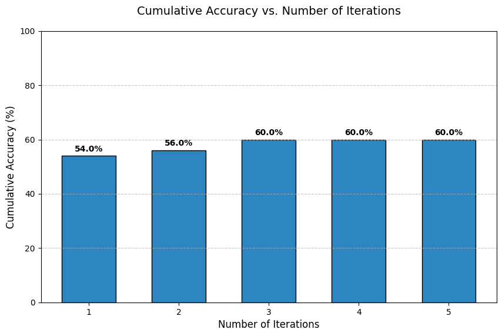

# Small Gemma Models for Code Generation

[](LICENSE)

## 📋 Overview

This research project investigates whether smaller Gemma models (1B, 4B) can achieve code generation capabilities comparable to their larger counterparts (12B, 27B) through various enhancement techniques. We explore:

- Few-shot learning approaches
- Self-improvement strategies
- Dual-model architectures

## 🔍 Research Questions

1. What are the baseline zero-shot capabilities across different Gemma model sizes?
2. How stable are smaller models' results in zero-shot scenarios?
3. What improvements can be achieved through few-shot approaches?
4. How does the number of examples in few-shot learning influence results?
5. How do example selection strategies impact few-shot learning outcomes?
6. Can self-improvement techniques enhance zero-shot or few-shot performance?

## 🧪 Methodology

### Dataset

We utilize a hand-verified subset of the [Mostly Basic Python Problems (MBPP)](https://github.com/google-research/google-research/tree/master/mbpp) benchmark. The original MBPP dataset includes 1,000 Python programming problems for entry-level programmers, each containing:
- Task description
- Reference solution
- 3 test cases for validation
Moreover, for the purpose of this repository we use 50 test examples due to computational budget limitations.

### Experimental Approaches

1. **Zero-shot baseline**: Direct code generation without examples
2. **Naive repetition**: Multiple generation attempts
3. **Self-improvement**: Iterative refinement using feedback from execution errors
4. **Dual-model approach**: Separate models for code and feedback generation

All experiments run locally on Apple Silicon M4 Pro processors for reproducibility.

## 📊 Key Findings

### Q1: Zero-Shot Capabilities Across Model Sizes

For our evaluation, we generated one code sample per problem with temperature set to $0.5$ and assessed whether it passed all three provided test cases.


Model performance gradually improves with parameter count, starting from 63.3% for the 1B model and reaching 90% for the 27B model.

### Q2: Results Stability in Zero-Shot Scenarios

We evaluated result stability by generating 5 different responses for each query and tracking accumulated accuracy across iterations.



Our analysis shows that results stabilize after 2-3 iterations, informing our experimental design choices. For subsequent experiments, we standardized on 3 iterations to ensure result comparability.

### Q3: Few-Shot Approach Improvements
Note: This section will be populated with results from the few-shot experiments currently in progress.

### Q4: Impact of Example Count in Few-Shot Learning
Note: This section will be populated with results analyzing how the number of examples affects few-shot performance.

### Q5: Example Selection Strategies
Note: This section will be populated with results comparing different strategies for selecting few-shot examples.

### Q6: Self-Improvement Techniques
We implemented several self-improvement approaches:

- Zero-shot self-improvement: The model iteratively refines its own code based on feedback
- Dual-model self-improvement: Separate models handle generation and analysis roles

## 🚀 Getting Started

### Prerequisites

- [uv](https://github.com/astral-sh/uv) - Modern Python package installer
- [ollama](https://ollama.com/download) - Local LLM runner

### Installation

1. Download Gemma models:
```bash
ollama pull gemma3:1b
ollama pull gemma3:4b
ollama pull gemma3:12b
ollama pull gemma3:27b
```

2. Install dependencies:
```bash
uv venv
uv pip install .
```

## 🔧 Usage

### Running Experiments

```bash
# Basic zero-shot experiments
uv run run_experiments.py --experiment_type zero-shot --experiment_name q1-zero-shot-gemma3:1b --model_name gemma3:1b
uv run run_experiments.py --experiment_type zero-shot --experiment_name q1-zero-shot-gemma3:4b --model_name gemma3:4b
uv run run_experiments.py --experiment_type zero-shot --experiment_name q1-zero-shot-gemma3:12b --model_name gemma3:12b
uv run run_experiments.py --experiment_type zero-shot --experiment_name q1-zero-shot-gemma3:27b --model_name gemma3:27b

# Stability analysis
uv run run_experiments.py --experiment_type zero-shot --experiment_name q2-gemma3:1b --model_name gemma3:1b --num-iterations 5
```

### Evaluation

Run evaluation for specific results:
```bash
# Q1 Experiments
uv run run_evaluation.py --results-path results/q1-zero-shot-gemma3:1b*.json
uv run run_evaluation.py --results-path results/q1-zero-shot-gemma3:4b*.json
uv run run_evaluation.py --results-path results/q1-zero-shot-gemma3:12b*.json
uv run run_evaluation.py --results-path results/q1-zero-shot-gemma3:27b*.json

uv run run_evaluation.py --results-path results/q2-gemma3:1b*.json
```

Generate visualizations:
```bash
uv run run_analysis.py
```

## 📝 License

[Apache License 2.0](LICENSE)
