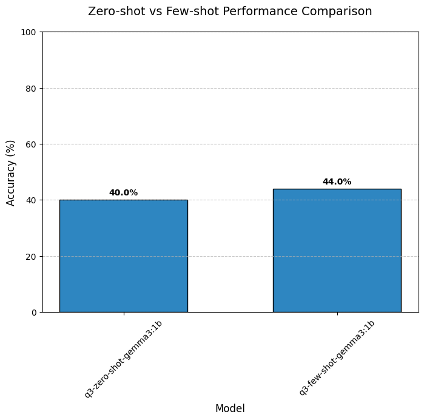
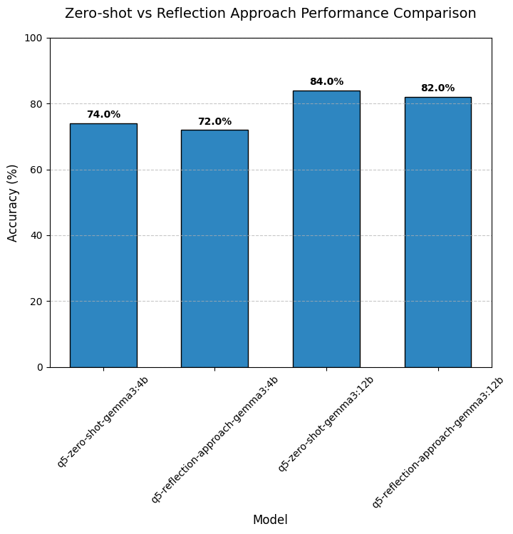
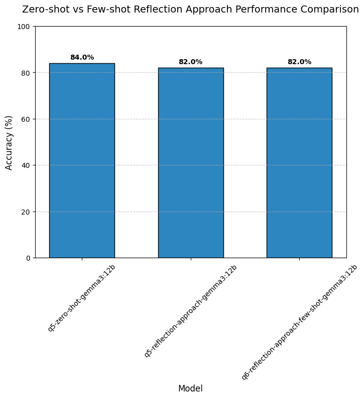

# Small Gemma Models for Code Generation

[](LICENSE)

## 📋 Overview

This research project investigates whether smaller Gemma models (1B, 4B) can achieve code generation capabilities comparable to their larger counterparts (12B, 27B) through various enhancement techniques. We explore:

- Zero-shot baseline approaches
- Few-shot learning approaches
- Zero- and few-shot approaches with additional reflection from additional model
- Vector search-based few-shot example retrieval

## 🔍 Research Questions

1. What are the baseline zero-shot capabilities across different Gemma model sizes?
2. How stable are smaller models' results in zero-shot scenarios?
3. What improvements can be achieved through few-shot approaches?
4. How does the number of examples in few-shot learning influence results?
5. Can the additional reflection from other agent regarding the task improve the results?
6. Can the few-shot examples and additional reflection significantly improves the results of Gemma 12B?
7. Can vector search-based few-shot example retrieval improve model performance compared to sequential selection?
8. How does the number of examples affect performance in vector search-based few-shot learning?

## 🧪 Methodology

### Dataset

We utilize a hand-verified subset of the [Mostly Basic Python Problems (MBPP)](https://github.com/google-research/google-research/tree/master/mbpp) benchmark. The original MBPP dataset includes 1,000 Python programming problems for entry-level programmers, each containing:
- Task description
- Reference solution
- 3 test cases for validation
Moreover, for the purpose of this repository we use 50 test examples due to computational budget limitations.

### Experimental Approaches

1. **Zero-shot baseline**: Direct code generation without examples
2. **Few-shot baseline**: Direct code generation with examples
3. **Reflection Agent**: Direct code generation with additional reflection regarding the task from the other agent
4. **Vector Search-based Few-Shot**: Using sentence transformers (all-MiniLM-L6-v2) to compute embeddings and select semantically similar examples based on cosine similarity

### Computational Resources

All experiments run locally on Apple Silicon M4 Pro processors for reproducibility.

## 📊 Key Findings

### Q1: Zero-Shot Capabilities Across Model Sizes

For our evaluation, we generated one code sample per problem with temperature set to $0.5$ and assessed whether it passed all three provided test cases. Moreover, we limited the model output tokens to 1000. Those settings will be the same for all the following experiments.


Model performance gradually improves with parameter count, starting from ~55% for the 1B model and reaching ~90% for the 27B model.

### Q2: Results Stability in Zero-Shot Scenarios

As we are operiting only on the small sample of the data, we evaluated result stability by generating 5 different responses for each query and tracked accumulated accuracy across iterations. Accumulated accuracy means whether the model in N number of trails had at least one success calculated over all test samples. This experiment was performed using Gemma3 1B.


Our analysis shows that results stabilize after 2-3 iterations, informing our experimental design choices. For subsequent experiments, we standardized on 3 iterations to ensure result comparability, unless stated otherwise.

### Q3: Zero-Shot vs. Few-Shot Comparison
We analyze the impact of providing examples for the model into the prompt. For that purpose we evaluate the zero-shot approach and few-shot approach with 3 examples. Both experiments are calculated three times and we calculate accuracy based on the information whether any of the model trials for each task was successful.



We can observe that the results for the provided runs were slightly improved. However, it's worth noting that the results of zero-shot approach are significantly lower than usual, e.g., presented in Q1 and Q2 results. One of the possible solutions to get the reliable results would be running the model by more iterations or evaluating model on more examples. However, both solutions require more computational budget. Finally, even though we have seen in Q2 that the results are stabilizing around 3 iterations, in pratice it turns out that it's not necessarily true.


### Q4: Impact of Example Count in Few-Shot Learning
In this section, we analyze the impact of number of examples to the model performance in a few-shot scenario. The methodology is similar to previous research questions, i.e., 3 runs with the accuracy at any successful attempt.


We can observe that increasing number of examples in the few-shot scenario has a significant impact on the model performance and has a reasonable trend of improved accuracy with the larger number of samples presented to the model in the prompt.

### Q5: Zero-shot vs Zero-shot Reflection Approach Comparison

In this section, we analyze whether providing additional reflection regarding the task from an agent using Gemma 4B model can improve the results. We compare the zero-shot approach with the reflection approach, where the model receives additional insights. For the purpose of this task we analyze only one iteration due to computational constraints. Moreover, we are using 4B and 12B models.



Suprisingly the additional reflection component don't make the model results stronger and the results for both 4B and 12B are on par.

### Q6: Zero-shot vs Few-shot Reflection Approach Comparison

In this section, we analyze whether combining few-shot learning with reflection can improve model performance compared to zero-shot. We compare the zero-shot approach with a reflection approach that includes both few-shot examples and task reflection. For this analysis, we use the Gemma 12B model and 3 few-shot examples.



Unfortunately the few-shot approach with reflection don't make the model results stronger either. It is somehow understandable from the perspective that few-shot approaches didn't improve the results significanly and reliably in Q3 and Q4.

### Q7: Vector Search-based Few-Shot Example Retrieval

In this section, we investigate whether using vector search to select semantically similar examples can improve the model's performance compared to sequential example selection. We use the sentence transformer model (all-MiniLM-L6-v2) to compute embeddings and find similar examples based on cosine similarity.


The results show that vector search-based example selection provides only a small accuracy improvement.

### Q8: Impact of Example Count in Vector Search-based Few-Shot Learning

Building on Q7, we analyze how the number of examples selected through vector search affects model performance. We compare different numbers of examples (1, 3, 5, and 7) to understand if more examples lead to better results.


Increasing the number of examples in vector search-based few-shot learning shows increasing accuracy for the larger amount of samples.

## Summary

Our research on Gemma models for code generation revealed that larger models (12B, 27B) consistently outperform smaller variants (1B, 4B) in zero-shot tasks. While multiple iterations improve success rates, they plateau after 3 attempts. Few-shot learning showed modest improvements that scaled with example count, though surprisingly, adding structured reflection components to prompts did not yield significant improvements. Vector-based example selection provided only marginal benefits over sequential selection. The results suggest that simpler approaches like basic few-shot learning can be as effective as more complex strategies, and that balancing model size with example count may be more practical than pursuing sophisticated prompt engineering techniques.

The final note, the conclusions might not be fully valid, as the previous experiments showed lack of the results stability.


## 🚀 Getting Started

### Prerequisites

- [uv](https://github.com/astral-sh/uv) - Modern Python package installer
- [ollama](https://ollama.com/download) - Local LLM runner
- Python 3.11 or higher

### Installation

1. Clone the repository:
```bash
git clone https://github.com/yourusername/small-gemma-models-for-code-generation.git
cd small-gemma-models-for-code-generation
```

2. Download Gemma models:
```bash
ollama pull gemma3:1b
ollama pull gemma3:4b
ollama pull gemma3:12b
ollama pull gemma3:27b
```

3. Create and activate virtual environment:
```bash
uv venv
source .venv/bin/activate  # On Unix/macOS
# or
.venv\Scripts\activate  # On Windows
```

4. Install dependencies:
```bash
uv pip install .
```

5. (Optional) Install development dependencies:
```bash
uv pip install -e ".[dev]"
```

## 🔧 Usage

### Running Experiments

```bash
# Q1: Basic zero-shot experiments
uv run run_experiments.py --experiment_type single-model --experiment_name q1-zero-shot-gemma3:1b --model_name gemma3:1b
uv run run_experiments.py --experiment_type single-model --experiment_name q1-zero-shot-gemma3:4b --model_name gemma3:4b
uv run run_experiments.py --experiment_type single-model --experiment_name q1-zero-shot-gemma3:12b --model_name gemma3:12b
uv run run_experiments.py --experiment_type single-model --experiment_name q1-zero-shot-gemma3:27b --model_name gemma3:27b

# Q2: Stability analysis
uv run run_experiments.py --experiment_type single-model --experiment_name q2-gemma3:1b --model_name gemma3:1b --num-iterations 5

# Q3: Zero-shot vs. Few-shot Comparison
uv run run_experiments.py --experiment_type single-model --experiment_name q3-zero-shot-gemma3:1b --model_name gemma3:1b --num-iterations 3 --num-few-shot-examples 0
uv run run_experiments.py --experiment_type single-model --experiment_name q3-few-shot-gemma3:1b --model_name gemma3:1b --num-iterations 3 --num-few-shot-examples 3

# Q4: Few-shot Number of Examples Analysis
uv run run_experiments.py --experiment_type single-model --experiment_name q4-few-shot-1-gemma3:1b --model_name gemma3:1b --num-iterations 3 --num-few-shot-examples 1
uv run run_experiments.py --experiment_type single-model --experiment_name q4-few-shot-3-gemma3:1b --model_name gemma3:1b --num-iterations 3 --num-few-shot-examples 3
uv run run_experiments.py --experiment_type single-model --experiment_name q4-few-shot-5-gemma3:1b --model_name gemma3:1b --num-iterations 3 --num-few-shot-examples 5
uv run run_experiments.py --experiment_type single-model --experiment_name q4-few-shot-7-gemma3:1b --model_name gemma3:1b --num-iterations 3 --num-few-shot-examples 7

# Q5: Reflection Approach
uv run run_experiments.py --experiment_type single-model --experiment_name q5-zero-shot-gemma3:4b --model_name gemma3:4b --num-iterations 1 --num-few-shot-examples 0
uv run run_experiments.py --experiment_type single-model --experiment_name q5-zero-shot-gemma3:12b --model_name gemma3:12b --num-iterations 1 --num-few-shot-examples 0
uv run run_experiments.py --experiment_type reflection-approach --experiment_name q5-reflection-approach-gemma3:4b --model_name gemma3:4b --num-iterations 1 --num-few-shot-examples 0
uv run run_experiments.py --experiment_type reflection-approach --experiment_name q5-reflection-approach-gemma3:12b --model_name gemma3:12b --num-iterations 1 --num-few-shot-examples 0

# Q6: Reflection with Few-Shot Examples
uv run run_experiments.py --experiment_type reflection-approach --experiment_name q6-reflection-approach-few-shot-gemma3:12b --model_name gemma3:12b --num-iterations 1 --num-few-shot-examples 2

# Q7: Few-Shot Examples via Vector Search
uv run run_experiments.py --experiment_type single-model --experiment_name q7-vector-search-few-shot-gemma3:1b --model_name gemma3:1b --num-iterations 3 --num-few-shot-examples 3 --use-vector-search

# Q8: Few-Shot Examples via Vector Search Number of Examples Analysis
uv run run_experiments.py --experiment_type single-model --experiment_name q8-vector-search-few-shot-1-gemma3:1b --model_name gemma3:1b --num-iterations 3 --num-few-shot-examples 1 --use-vector-search
uv run run_experiments.py --experiment_type single-model --experiment_name q8-vector-search-few-shot-3-gemma3:1b --model_name gemma3:1b --num-iterations 3 --num-few-shot-examples 3 --use-vector-search
uv run run_experiments.py --experiment_type single-model --experiment_name q8-vector-search-few-shot-5-gemma3:1b --model_name gemma3:1b --num-iterations 3 --num-few-shot-examples 5 --use-vector-search
uv run run_experiments.py --experiment_type single-model --experiment_name q8-vector-search-few-shot-7-gemma3:1b --model_name gemma3:1b --num-iterations 3 --num-few-shot-examples 7 --use-vector-search
```

### Evaluation

Run evaluation for specific results:
```bash
# Q1 Experiments
uv run run_evaluation.py --results-path results/q1-zero-shot-gemma3:1b*.json
uv run run_evaluation.py --results-path results/q1-zero-shot-gemma3:4b*.json
uv run run_evaluation.py --results-path results/q1-zero-shot-gemma3:12b*.json
uv run run_evaluation.py --results-path results/q1-zero-shot-gemma3:27b*.json

# Q2 Experiments
uv run run_evaluation.py --results-path results/q2-gemma3:1b*.json

# Q3 Experiments
uv run run_evaluation.py --results-path results/q3-zero-shot-gemma3:1b*.json
uv run run_evaluation.py --results-path results/q3-few-shot-gemma3:1b*.json

# Q4 Experiments
uv run run_evaluation.py --results-path results/q4-few-shot-1-gemma3:1b*.json
uv run run_evaluation.py --results-path results/q4-few-shot-3-gemma3:1b*.json
uv run run_evaluation.py --results-path results/q4-few-shot-5-gemma3:1b*.json
uv run run_evaluation.py --results-path results/q4-few-shot-7-gemma3:1b*.json

# Q5 Experiments
uv run run_evaluation.py --results-path results/q5-zero-shot-gemma3:4b*.json
uv run run_evaluation.py --results-path results/q5-zero-shot-gemma3:12b*.json
uv run run_evaluation.py --results-path results/q5-reflection-approach-gemma3:4b*.json
uv run run_evaluation.py --results-path results/q5-reflection-approach-gemma3:12b*.json

# Q6 Experiments
uv run run_evaluation.py --results-path results/q6-reflection-approach-few-shot-gemma3:12b*.json

# Q7 Experiments
uv run run_evaluation.py --results-path results/q7-vector-search-few-shot-gemma3:1b*.json

# Q8 Experiments
uv run run_evaluation.py --results-path results/q8-vector-search-few-shot-1-gemma3:1b*.json
uv run run_evaluation.py --results-path results/q8-vector-search-few-shot-3-gemma3:1b*.json
uv run run_evaluation.py --results-path results/q8-vector-search-few-shot-5-gemma3:1b*.json
uv run run_evaluation.py --results-path results/q8-vector-search-few-shot-7-gemma3:1b*.json
```

Generate visualizations:
```bash
uv run run_analysis.py
```

## 📝 License

[Apache License 2.0](LICENSE)
